# Cloud Manager API — Data Model

Auto-generated from `CloudManager.Entities` (EF Core 8, PostgreSQL via Npgsql).
Every entity inherits the `Audit` base class, so every table carries the same
`public_id`, `created`, `created_by`, `modified`, `modified_by` columns. Those
audit columns are shown explicitly on each entity in the diagram below.

## Schemas

The Postgres database splits tables across four schemas:

| Schema       | Tables |
|--------------|--------|
| `bare_metal` | `hosts`, `designated_hosts`, `iso_files` |
| `network`    | `configurations`, `addresses` |
| `membership` | `organizations`, `users`, `roles`, `teams`, `user_roles`, `user_teams`, `team_roles` |
| `vm`         | `virtual_machines`, `virtual_machine_images`, `snapshots`, `orchestration_commands`, `playbooks`, `playbook_revisions`, `ansible_roles`, `role_files`, `role_file_revisions`, `playbook_global_role_refs`, `playbook_roles`, `playbook_role_files`, `playbook_role_file_revisions`, `vm_playbook_assignments`, `playbook_runs`, `playbook_run_targets` |
| `public`     | `VirtualDevices` *(unschemed, PascalCase — not yet migrated)* |

## Enums

| Enum                 | Values                                            | Storage     |
|----------------------|---------------------------------------------------|-------------|
| `OrchestrationStatus`| `Initialized`, `InProgress`, `Completed`, `Failed`| Postgres enum (string) |
| `MachineStatus`      | `Running`, `Off`                                  | Postgres enum (string) |
| `PlaybookRunStatus`  | `None`, `Queued`, `Running`, `Succeeded`, `Failed`, `Cancelled` | Postgres enum (int) |

## Identifier Strategy

- `id` (`uuid`) — primary key, internal joins only, never on the wire.
- `public_id` (`varchar(32)`) — Stripe-style `<prefix>_<10 Crockford base32>`
  identifier (e.g. `vm_8x3k2pm9wq`). Generated on insert by
  `PublicIdInterceptor`. This is what the API surface, libvirt, and Vault key
  off. See `PUBLIC-ID-PLAN.md` (in `cloud-manager/planning/`) for the full
  rationale.

## Entity-Relationship Diagram

```mermaid
erDiagram
    %% ─── bare_metal ───
    Host {
        uuid id PK
        string public_id UK
        string name UK
        string description
        jsonb config
        uuid network_configuration_id FK
        datetime created
        string created_by
        datetime modified
        string modified_by
    }
    DesignatedHost {
        uuid id PK
        string public_id UK
        string name UK
        string description
        jsonb config
        datetime created
        string created_by
        datetime modified
        string modified_by
    }
    IsoFile {
        uuid id PK
        string public_id UK
        string name UK
        string description
        uuid host_id FK
        datetime created
        string created_by
        datetime modified
        string modified_by
    }

    %% ─── network ───
    NetworkConfiguration {
        uuid id PK
        string public_id UK
        string name UK
        string description
        bool bridge
        string mask
        string reserved_start
        string reserved_end
        string dynamic_start
        string dynamic_end
        string gateway_address
        string primary_dns
        string secondary_dns
        datetime created
        string created_by
        datetime modified
        string modified_by
    }
    NetworkAddress {
        uuid id PK
        string public_id UK
        string ip_address
        uuid host_id FK
        uuid designated_host_id FK
        uuid virtual_machine_id
        uuid network_id FK
        datetime created
        string created_by
        datetime modified
        string modified_by
    }

    %% ─── membership ───
    Organization {
        uuid id PK
        string public_id UK
        string name UK
        string description
        string address
        string address2
        string city
        string state
        string postalcode
        string admin_email
        string domain
        datetime created
        string created_by
        datetime modified
        string modified_by
    }
    User {
        uuid id PK
        string public_id UK
        string email UK
        string first_name
        string last_name
        string password_hash
        uuid organization_id FK
        string login_provider
        string provider_key
        datetime created
        string created_by
        datetime modified
        string modified_by
    }
    Role {
        uuid id PK
        string public_id UK
        string name UK
        string description
        datetime created
        string created_by
        datetime modified
        string modified_by
    }
    Team {
        uuid id PK
        string public_id UK
        string name UK
        string description
        string department
        datetime created
        string created_by
        datetime modified
        string modified_by
    }
    UserRole {
        uuid id PK
        string public_id UK
        uuid user_id FK
        uuid role_id FK
        datetime created
        string created_by
        datetime modified
        string modified_by
    }
    UserTeam {
        uuid id PK
        string public_id UK
        uuid user_id FK
        uuid team_id FK
        datetime created
        string created_by
        datetime modified
        string modified_by
    }
    TeamRole {
        uuid id PK
        string public_id UK
        uuid team_id FK
        uuid role_id FK
        datetime created
        string created_by
        datetime modified
        string modified_by
    }

    %% ─── vm — existing ───
    VirtualMachineImage {
        uuid id PK
        string public_id UK
        string name
        string description
        jsonb config
        string version
        string filename
        uuid iso_file_id FK
        uuid host_id FK
        datetime created
        string created_by
        datetime modified
        string modified_by
    }
    VirtualMachine {
        uuid id PK
        string public_id UK
        string name UK
        string description
        jsonb config
        int memory
        string mac_address UK
        OrchestrationStatus orchestration_status
        MachineStatus machine_status
        uuid host_id FK
        uuid virtual_machine_image_id FK
        uuid active_snapshot_id FK
        datetime created
        string created_by
        datetime modified
        string modified_by
    }
    VirtualMachineSnapshot {
        uuid id PK
        string public_id UK
        string name
        string description
        OrchestrationStatus orchestration_status
        uuid virtual_machine_id FK
        uuid parent_snapshot_id FK
        datetime created
        string created_by
        datetime modified
        string modified_by
    }
    OrchestrationCommand {
        uuid id PK
        string public_id UK
        string name
        string description
        bool completed
        bool succeeded
        OrchestrationStatus orchestration_status
        uuid virtual_machine_id FK
        uuid snapshot_id FK
        datetime created
        string created_by
        datetime modified
        string modified_by
    }
    VirtualDevice {
        uuid id PK
        string public_id UK
        string name
        string description
        string type
        jsonb config
        uuid host_id FK
        datetime created
        string created_by
        datetime modified
        string modified_by
    }

    %% ─── vm — playbook (modified) ───
    Playbook {
        uuid id PK
        string public_id UK
        string name UK
        string description
        text content
        jsonb argument_schema
        jsonb output_schema
        datetime created
        string created_by
        datetime modified
        string modified_by
    }
    PlaybookRevision {
        uuid id PK
        string public_id UK
        uuid playbook_id FK
        int revision_number
        text content
        string change_summary
        datetime created
        string created_by
        datetime modified
        string modified_by
    }

    %% ─── vm — global ansible role library (new) ───
    AnsibleRole {
        uuid id PK
        string public_id UK
        string name UK
        string description
        datetime created
        string created_by
        datetime modified
        string modified_by
    }
    RoleFile {
        uuid id PK
        string public_id UK
        uuid role_id FK
        string file_path
        text content
        datetime created
        string created_by
        datetime modified
        string modified_by
    }
    RoleFileRevision {
        uuid id PK
        string public_id UK
        uuid role_file_id FK
        int revision_number
        text content
        string change_summary
        datetime created
        string created_by
        datetime modified
        string modified_by
    }

    %% ─── vm — playbook-local roles (new) ───
    PlaybookGlobalRoleRef {
        uuid id PK
        string public_id UK
        uuid playbook_id FK
        uuid ansible_role_id FK
        datetime created
        string created_by
        datetime modified
        string modified_by
    }
    PlaybookRole {
        uuid id PK
        string public_id UK
        uuid playbook_id FK
        string name
        string description
        datetime created
        string created_by
        datetime modified
        string modified_by
    }
    PlaybookRoleFile {
        uuid id PK
        string public_id UK
        uuid playbook_role_id FK
        string file_path
        text content
        datetime created
        string created_by
        datetime modified
        string modified_by
    }
    PlaybookRoleFileRevision {
        uuid id PK
        string public_id UK
        uuid playbook_role_file_id FK
        int revision_number
        text content
        string change_summary
        datetime created
        string created_by
        datetime modified
        string modified_by
    }

    %% ─── vm — execution (modified + new) ───
    VmPlaybookAssignment {
        uuid id PK
        string public_id UK
        uuid virtual_machine_id FK
        uuid playbook_id FK
        jsonb vars_override
        uuid last_run_id FK
        PlaybookRunStatus last_run_status
        datetime last_applied_at
        datetime created
        string created_by
        datetime modified
        string modified_by
    }
    PlaybookRun {
        uuid id PK
        string public_id UK
        uuid playbook_id FK
        uuid playbook_revision_id FK
        PlaybookRunStatus status
        datetime started_at
        datetime completed_at
        jsonb stats
        jsonb vars_snapshot
        text output
        string vault_secrets_prefix
        jsonb secrets_published
        string error_message
        datetime created
        string created_by
        datetime modified
        string modified_by
    }
    PlaybookRunTarget {
        uuid id PK
        string public_id UK
        uuid run_id FK
        uuid vm_id FK
        uuid assignment_id FK
        jsonb vars_override_snapshot
        PlaybookRunStatus status
        jsonb stats
        text output
        datetime created
        string created_by
        datetime modified
        string modified_by
    }

    %% ─── bare_metal + network ───
    Host ||--|| NetworkConfiguration : "host.network_configuration_id"
    Host ||--o{ IsoFile : "iso_file.host_id"
    Host ||--o{ VirtualMachineImage : "vmi.host_id"
    Host ||--o{ VirtualDevice : "vdev.host_id"
    Host ||--o{ NetworkAddress : "naddr.host_id"
    Host ||--o{ VirtualMachine : "vm.host_id"
    NetworkConfiguration ||--o{ NetworkAddress : "naddr.network_id"
    DesignatedHost ||--o{ NetworkAddress : "naddr.designated_host_id"

    %% ─── vm ───
    IsoFile ||--o{ VirtualMachineImage : "vmi.iso_file_id"
    VirtualMachineImage ||--o{ VirtualMachine : "vm.virtual_machine_image_id"
    VirtualMachine ||--o{ VirtualMachineSnapshot : "snapshot.virtual_machine_id"
    VirtualMachine ||--o| VirtualMachineSnapshot : "vm.active_snapshot_id"
    VirtualMachineSnapshot ||--o{ VirtualMachineSnapshot : "snapshot.parent_snapshot_id"
    VirtualMachine ||--o{ OrchestrationCommand : "ocmd.virtual_machine_id"
    VirtualMachineSnapshot ||--o{ OrchestrationCommand : "ocmd.snapshot_id"

    %% ─── membership ───
    Organization ||--o{ User : "user.organization_id"
    User ||--o{ UserRole : "user_role.user_id"
    Role ||--o{ UserRole : "user_role.role_id"
    User ||--o{ UserTeam : "user_team.user_id"
    Team ||--o{ UserTeam : "user_team.team_id"
    Team ||--o{ TeamRole : "team_role.team_id"
    Role ||--o{ TeamRole : "team_role.role_id"

    %% ─── playbook management ───
    Playbook ||--o{ PlaybookRevision : "revision.playbook_id"
    Playbook ||--o{ PlaybookGlobalRoleRef : "ref.playbook_id"
    AnsibleRole ||--o{ PlaybookGlobalRoleRef : "ref.ansible_role_id"
    AnsibleRole ||--o{ RoleFile : "rfile.role_id"
    RoleFile ||--o{ RoleFileRevision : "rfrev.role_file_id"
    Playbook ||--o{ PlaybookRole : "prole.playbook_id"
    PlaybookRole ||--o{ PlaybookRoleFile : "prfile.playbook_role_id"
    PlaybookRoleFile ||--o{ PlaybookRoleFileRevision : "prfrev.playbook_role_file_id"

    %% ─── execution ───
    Playbook ||--o{ PlaybookRun : "run.playbook_id"
    Playbook ||--o{ VmPlaybookAssignment : "assign.playbook_id"
    PlaybookRevision |o--o{ PlaybookRun : "run.playbook_revision_id"
    PlaybookRun ||--o{ PlaybookRunTarget : "target.run_id"
    PlaybookRun |o--o{ VmPlaybookAssignment : "assign.last_run_id"
    VirtualMachine ||--o{ VmPlaybookAssignment : "assign.virtual_machine_id"
    VirtualMachine ||--o{ PlaybookRunTarget : "target.vm_id"
    VmPlaybookAssignment |o--o{ PlaybookRunTarget : "target.assignment_id"
```

## Notes

- **`NetworkAddress.virtual_machine_id`** has no FK constraint declared in the
  `DbContext` (only an index), so it's shown without an `FK` marker. The
  application treats it as a soft reference.
- **`OrchestrationCommand.snapshot_id`** is declared as a foreign key in EF
  config but not in the snapshot of the entity-relationship intent; it's
  optional (`Guid?`) and only set for snapshot-related commands.
- **`VirtualMachine.active_snapshot_id`** is modeled as one-to-zero-or-one
  (a VM has at most one active snapshot at any time).
- **`VirtualMachineSnapshot`** is self-referential — every snapshot can have
  zero-or-many children via `parent_snapshot_id`, forming a snapshot tree per VM.
- **`VirtualDevices`** is the only table not yet migrated to a Postgres schema
  (still in `public`, PascalCase). Cleanup pending.
- **`Playbook.content`** replaces the former git-backed fields (`git_url`,
  `git_ref`, `playbook_path`, `last_refreshed_at`). The DB is now the source
  of truth; YAML files are generated from DB content at execution time.
- **`Playbook.argument_schema`** is a derived/computed field. It is
  automatically re-parsed from `meta/argument_specs.yml` whenever that
  `RoleFile` or `PlaybookRoleFile` is saved, using `ArgumentSpecsTranslator`.
  If a global role's `meta/argument_specs.yml` changes, all playbooks
  referencing it via `PlaybookGlobalRoleRef` are updated in the same
  transaction.
- **`AnsibleRole`** is the global shared role library (name globally unique).
  **`PlaybookRole`** is a role scoped to a single playbook (name unique per
  playbook). Both use the same file/revision pattern but are kept as separate
  entities to make ownership explicit.
- **`PlaybookRevision`** and **`RoleFileRevision`** / **`PlaybookRoleFileRevision`**
  use per-entity sequential `revision_number` counters (Option A). Each entity
  maintains its own independent 1, 2, 3… history.
- **`PlaybookRun`** is no longer tied to a single `VmPlaybookAssignment`.
  It owns the execution directly via `playbook_id`. Per-VM targeting, status,
  stats, and output are recorded on `PlaybookRunTarget` rows — one per VM per
  run. This supports both single-VM (v1) and multi-VM execution without schema
  changes.
- **`PlaybookRunTarget.assignment_id`** is nullable — a run target can be
  created without a formal assignment (ad-hoc targeting in future).
- **`VmPlaybookAssignment.last_run_id`** points to `PlaybookRun` (the overall
  run), not to an individual target row.
